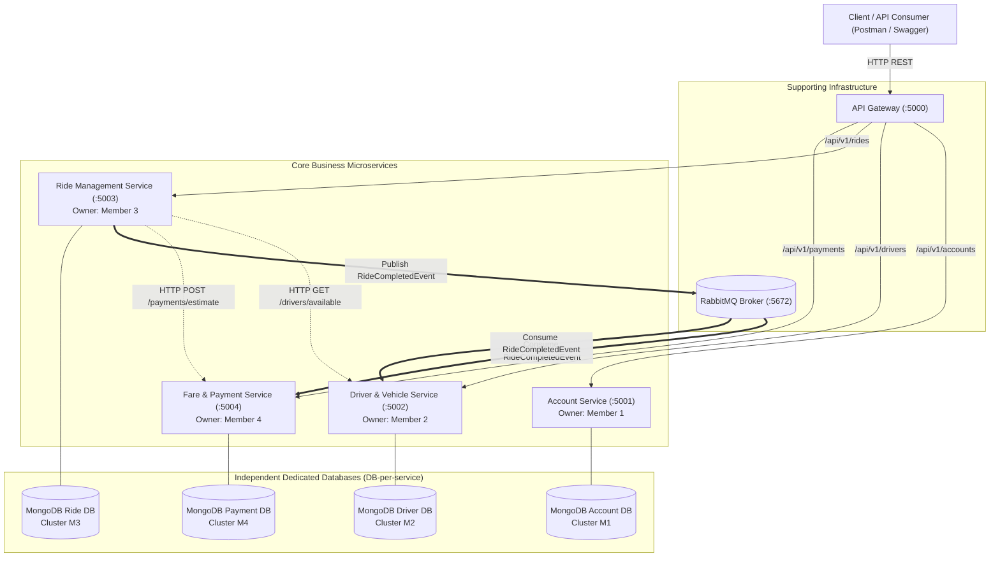

# RideLink - Architecture Diagram

## High-Level Microservices Architecture

The diagram below illustrates the 4 core business microservices, their supporting API Gateway, dedicated database ownership per service, and the asynchronous messaging broker.

> **TODO**: Refine specific internal routing rules, exchange names, and queue configurations during individual service implementation phases.
