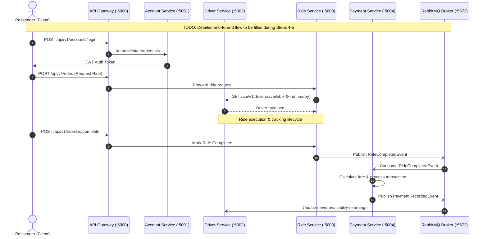

# RideLink - Sequence Diagram

## End-to-End Ride & Payment Interaction Flow

The diagram below outlines the core actors and service boundaries participating in the RideLink lifecycle.

```mermaid
sequenceDiagram
    autonumber
    actor Passenger as Passenger (Client)
    participant Gateway as API Gateway (:5000)
    participant AccountService as Account Service (:5001)
    participant DriverService as Driver Service (:5002)
    participant RideService as Ride Service (:5003)
    participant PaymentService as Payment Service (:5004)
    participant RabbitMQ as RabbitMQ Broker (:5672)

    %% Flow Skeleton Placeholder
    Note over Passenger,RabbitMQ: TODO: Detailed end-to-end flow to be filled during Steps 4-5

    Passenger->>Gateway: POST /api/v1/accounts/login
    Gateway->>AccountService: Authenticate credentials
    AccountService-->>Passenger: JWT Auth Token

    Passenger->>Gateway: POST /api/v1/rides (Request Ride)
    Gateway->>RideService: Forward ride request

    RideService->>DriverService: GET /api/v1/drivers/available (Find nearby)
    DriverService-->>RideService: Driver matched

    Note over RideService,DriverService: Ride execution & tracking lifecycle

    Passenger->>Gateway: POST /api/v1/rides/:id/complete
    Gateway->>RideService: Mark Ride Completed

    RideService-)RabbitMQ: Publish RideCompletedEvent
    RabbitMQ-)PaymentService: Consume RideCompletedEvent
    PaymentService->>PaymentService: Calculate fare & process transaction
    PaymentService-)RabbitMQ: Publish PaymentRecordedEvent
    RabbitMQ-)DriverService: Update driver availability / earnings
```
